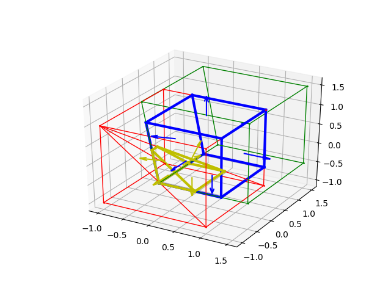

# Geometry3D

## About Geometry3D

Geometry3D is a simple python computational geographics library written in python.
This library focuses on the functions and lacks efficiency which might be improved in future version.


## Core Features
- Basic 3D Geometries: Point, Line, Plane, Segment, Convex Polygon and Convex Polyhedron.
- Simple Object like Cubic, Sphere, Cylinder, Cone, Rectangle, Parallepiped, Parallogram and Circle.  
- Basic Attributes Of Geometries: length, area, volume.
- Basic Relationships And Operations Between Geometries: move, angle, parallel, orthogonal, intersection.
- Overload Build-In Functions Such As `__contains__`, `__hash__`, `__eq__`, `__neg__`.
- A Naive Renderer Using `matplotlib`.




Some of the code comes from [sgl](https://github.com/Kingdread/sgl) whose author is really humorous.

## Requirements

* [Python](http://www.python.org) 3 
* No additional third-party library is required, it's written in pure python and standard library. 
* Matplotlib is needed if you want to use the renderer.

## Documentation

[](https://geometry3d.readthedocs.io/en/latest/?badge=latest)

- [https://geometry3d.readthedocs.io/en/latest](https://geometry3d.readthedocs.io/en/latest/)

- [pdf](https://geometry3d.readthedocs.io/_/downloads/en/latest/pdf/)

## Installation
```bash
pip install Geometry3D
```

## Test
### Unit Tests
```bash
python run_tests.py
```

### Tests
Run .py files under g3d_tests folder.
For example:
```bash
python g3d_tests/test1.py
```

## Usage

See Documentations

## Change Log

[changelog.md](changelog.md)

## License

    This program is free software: you can redistribute it and/or modify
    it under the terms of the GNU General Public License as published by
    the Free Software Foundation, either version 3 of the License, or
    (at your option) any later version.

    This program is distributed in the hope that it will be useful,
    but WITHOUT ANY WARRANTY; without even the implied warranty of
    MERCHANTABILITY or FITNESS FOR A PARTICULAR PURPOSE.  See the
    GNU General Public License for more details.

    You should have received a copy of the GNU General Public License
    along with this program.  If not, see <http://www.gnu.org/licenses/>.

## Contact
gouminghao@gmail.com
