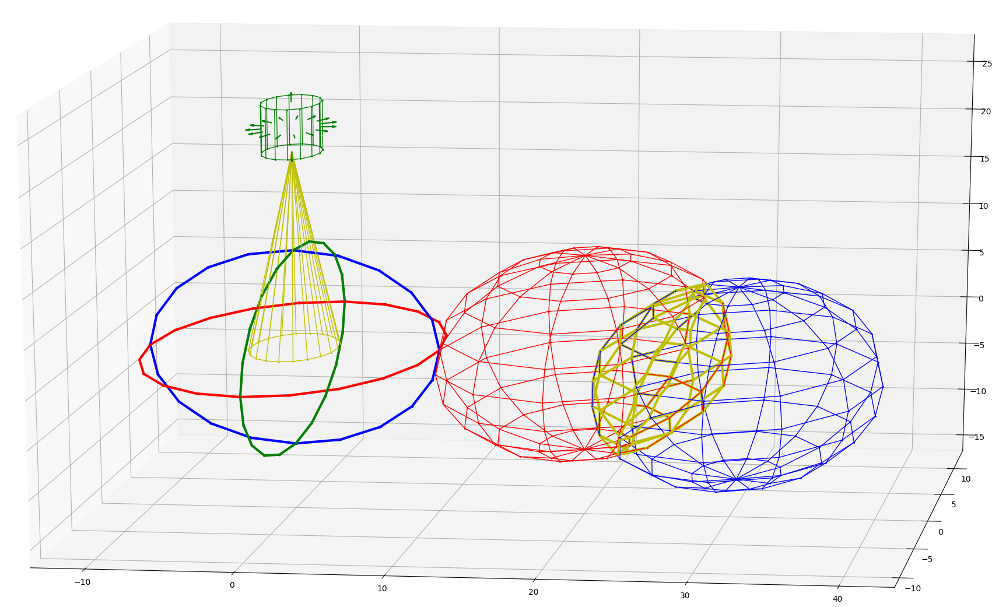

Creating Geometries
===================

Creating Point
--------------

Creating a Point using three cordinates::

    >>> from Geometry3D import *
    >>> pa = Point(1,2,3)
    >>> pa
    Point(1, 2, 3)

Creating a Point using a list of coordinates::

    >>> pb = Point([2,4,3])
    >>> pb
    Point(2, 4, 3)

Specifically, special Point can be created using class function::

    >>> o = origin()
    >>> o
    Point(0, 0, 0)

Creating Vector
---------------

Creating a Vector using three cordinates::

    >>> from Geometry3D import *
    >>> va = Vector(1,2,3)
    >>> va
    Vector(1, 2, 3)

Creating a Vector using two Points::

    >>> pa = Point(1,2,3)
    >>> pb = Point(2,3,1)
    >>> vb = Vector(pa,pb)
    >>> vb
    Vector(1, 1, -2)

Creating a Vector using a list of coordinates::

    >>> vc = Vector([1,2,4])
    >>> vc
    Vector(1, 2, 4)

Specifically, special Vectors can be created using class functions::

    >>> x_unit_vector()
    Vector(1, 0, 0)
    >>> y_unit_vector()
    Vector(0, 1, 0)
    >>> z_unit_vector()
    Vector(0, 0, 1)

Creating Line
-------------

Creating Line using two Points::

    >>> from Geometry3D import *
    >>> pa = Point(1,2,3)
    >>> pb = Point(2,3,1)
    >>> l = Line(pa,pb)
    >>> l
    Line(sv=Vector(1, 2, 3),dv=Vector(1, 1, -2))

Creating Line using two Vectors::

    >>> va = Vector(1,2,3)
    >>> vb = Vector(-1,-2,-1)
    >>> l = Line(va,vb)
    >>> l
    Line(sv=Vector(1, 2, 3),dv=Vector(-1, -2, -1))

Creating Line using a Point and a Vector::

    Line(sv=Vector(1, 2, 3),dv=Vector(-1, -2, -1))
    >>> pa = Point(2,6,-2)
    >>> v = Vector(2,0,4)
    >>> l = Line(pa,v)
    >>> l
    Line(sv=Vector(2, 6, -2),dv=Vector(2, 0, 4))

Specifically, special Lines can be created using class functions::

    >>> x_axis()
    Line(sv=Vector(0, 0, 0),dv=Vector(1, 0, 0))
    >>> y_axis()
    Line(sv=Vector(0, 0, 0),dv=Vector(0, 1, 0))
    >>> z_axis()
    Line(sv=Vector(0, 0, 0),dv=Vector(0, 0, 1))

Creating Plane
--------------

Creating Plane using three Points::

    >>> from Geometry3D import *
    >>> p1 = origin()
    >>> p2 = Point(1,0,0)
    >>> p3 = Point(0,1,0)
    >>> p = Plane(p1,p2,p3)
    >>> p
    Plane(Point(0, 0, 0), Vector(0, 0, 1))

Creating Plane using a Point and two Vectors::

    >>> p1 = origin()
    >>> v1 = x_unit_vector()
    >>> v2 = z_unit_vector()
    >>> p = Plane(p1,v1,v2)
    >>> p
    Plane(Point(0, 0, 0), Vector(0, -1, 0))

Creating Plane using a Point and a Vector::

    >>> p1 = origin()
    >>> p = Plane(p1,Vector(1,1,1))
    >>> p
    Plane(Point(0, 0, 0), Vector(1, 1, 1))

Creating Plane using four parameters::

    # Plane(a, b, c, d):
    # Initialise a plane given by the equation
    # ax1 + bx2 + cx3 = d (general form).
    >>> p = Plane(1,2,3,4)
    >>> p
    Plane(Point(-1.0, 1.0, 1.0), Vector(1, 2, 3))

Specifically, special Planes can be created using class functions::

    >>> xy_plane()
    Plane(Point(0, 0, 0), Vector(0, 0, 1))
    >>> yz_plane()
    Plane(Point(0, 0, 0), Vector(1, 0, 0))
    >>> xz_plane()
    Plane(Point(0, 0, 0), Vector(0, 1, 0))

Creating Segment
----------------

Creating Segment using two Points::

    >>> from Geometry3D import *
    >>> p1 = Point(0,0,2)
    >>> p2 = Point(-1,2,0)
    >>> s = Segment(p1,p2)
    >>> s
    Segment(Point(0, 0, 2), Point(-1, 2, 0))

Creating Segment using a Point and a Vector::

    >>> s = Segment(origin(),x_unit_vector())
    >>> s
    Segment(Point(0, 0, 0), Point(1, 0, 0))

Creating ConvexPolygon
----------------------

Creating ConvexPolygon using a tuple of points::

    >>> from Geometry3D import *
    >>> pa = origin()
    >>> pb = Point(1,1,0)
    >>> pc = Point(1,0,0)
    >>> pd = Point(0,1,0)
    >>> cpg = ConvexPolygon((pa,pb,pc,pd))
    >>> cpg
    ConvexPolygon((Point(0, 0, 0), Point(0, 1, 0), Point(1, 1, 0), Point(1, 0, 0)))

Specifically, Parallelogram can be created using one Point and two Vectors::

    >>> pa = origin()
    >>> cpg = Parallelogram(pa,x_unit_vector(),y_unit_vector())
    >>> cpg
    ConvexPolygon((Point(0, 0, 0), Point(1, 0, 0), Point(1, 1, 0), Point(0, 1, 0)))

Creating ConvexPolyhedron
-------------------------

Creating ConvexPolyhedron using a tuple of ConvexPolygons::

    >>> from Geometry3D import *
    >>> a = Point(1,1,1)
    >>> b = Point(-1,1,1)
    >>> c = Point(-1,-1,1)
    >>> d = Point(1,-1,1)
    >>> e = Point(1,1,-1)
    >>> f = Point(-1,1,-1)
    >>> g = Point(-1,-1,-1)
    >>> h = Point(1,-1,-1)
    >>> cpg0 = ConvexPolygon((a,d,h,e))
    >>> cpg1 = ConvexPolygon((a,e,f,b))
    >>> cpg2 = ConvexPolygon((c,b,f,g))
    >>> cpg3 = ConvexPolygon((c,g,h,d))
    >>> cpg4 = ConvexPolygon((a,b,c,d))
    >>> cpg5 = ConvexPolygon((e,h,g,f))
    >>> cph0 = ConvexPolyhedron((cpg0,cpg1,cpg2,cpg3,cpg4,cpg5))
    >>> cph0
    ConvexPolyhedron
    pyramid set:{Pyramid(ConvexPolygon((Point(1, 1, -1), Point(1, -1, -1), Point(-1, -1, -1), Point(-1, 1, -1))), Point(0.0, 0.0, 0.0)), Pyramid(ConvexPolygon((Point(1, 1, 1), Point(1, 1, -1), Point(-1, 1, -1), Point(-1, 1, 1))), Point(0.0, 0.0, 0.0)), Pyramid(ConvexPolygon((Point(-1, -1, 1), Point(-1, 1, 1), Point(-1, 1, -1), Point(-1, -1, -1))), Point(0.0, 0.0, 0.0)), Pyramid(ConvexPolygon((Point(-1, -1, 1), Point(-1, -1, -1), Point(1, -1, -1), Point(1, -1, 1))), Point(0.0, 0.0, 0.0)), Pyramid(ConvexPolygon((Point(1, 1, 1), Point(1, -1, 1), Point(1, -1, -1), Point(1, 1, -1))), Point(0.0, 0.0, 0.0)), Pyramid(ConvexPolygon((Point(1, 1, 1), Point(-1, 1, 1), Point(-1, -1, 1), Point(1, -1, 1))), Point(0.0, 0.0, 0.0))}
    point set:{Point(1, 1, -1), Point(-1, -1, -1), Point(1, -1, 1), Point(-1, 1, 1), Point(1, 1, 1), Point(-1, -1, 1), Point(-1, 1, -1), Point(1, -1, -1)}

Specifically, Parallelepiped can be created using a Point and Three Vectors::

    >>> cph = Parallelepiped(origin(),x_unit_vector(),y_unit_vector(),z_unit_vector())
    >>> cph
    ConvexPolyhedron
    pyramid set:{Pyramid(ConvexPolygon((Point(1, 1, 1), Point(0, 1, 1), Point(0, 1, 0), Point(1, 1, 0))), Point(0.5, 0.5, 0.5)), Pyramid(ConvexPolygon((Point(0, 0, 0), Point(0, 1, 0), Point(0, 1, 1), Point(0, 0, 1))), Point(0.5, 0.5, 0.5)), Pyramid(ConvexPolygon((Point(0, 0, 0), Point(1, 0, 0), Point(1, 0, 1), Point(0, 0, 1))), Point(0.5, 0.5, 0.5)), Pyramid(ConvexPolygon((Point(1, 1, 1), Point(1, 0, 1), Point(1, 0, 0), Point(1, 1, 0))), Point(0.5, 0.5, 0.5)), Pyramid(ConvexPolygon((Point(0, 0, 0), Point(1, 0, 0), Point(1, 1, 0), Point(0, 1, 0))), Point(0.5, 0.5, 0.5)), Pyramid(ConvexPolygon((Point(1, 1, 1), Point(0, 1, 1), Point(0, 0, 1), Point(1, 0, 1))), Point(0.5, 0.5, 0.5))}
    point set:{Point(0, 0, 1), Point(1, 1, 1), Point(1, 1, 0), Point(0, 1, 1), Point(1, 0, 1), Point(0, 0, 0), Point(1, 0, 0), Point(0, 1, 0)}

Creating HalfLine
-----------------

Creating HalfLine using two Points or a Point and a Vector::

    >>> from Geometry3D import *
    >>> HalfLine(origin(),Point(1,0,0))
    HalfLine(Point(0, 0, 0), Vector(1, 0, 0))
    >>> HalfLine(origin(),y_unit_vector())
    HalfLine(Point(0, 0, 0), Vector(0, 1, 0))

Other Geometries
----------------

Inscribed convex polygon and convex polyhedron of circle, cylinder, sphere, cone are also available::

    >>> from Geometry3D import *
    >>> import copy
    >>> 
    >>> b = Circle(origin(),y_unit_vector(),10,20)
    >>> a = Circle(origin(),x_unit_vector(),10,20)
    >>> c = Circle(origin(),z_unit_vector(),10,20)
    >>> r = Renderer()
    >>> r.add((a,'g',3))
    >>> r.add((b,'b',3))
    >>> r.add((c,'r',3))
    >>> 
    >>> s1 = Sphere(Point(20,0,0),10,n1=12,n2=5)
    >>> s2 = copy.deepcopy(s1).move(Vector(10,2,-3.9))
    >>> s3 = intersection(s1,s2)
    >>> 
    >>> r.add((s1,'r',1))
    >>> r.add((s2,'b',1))
    >>> r.add((s3,'y',3))
    >>> 
    >>> cone = Cone(origin(),3,20 * z_unit_vector(),n=20)
    >>> r.add((cone,'y',1),normal_length=0)
    >>> 
    >>> cylinder = Cylinder(Point(0,0,20),2,5 * z_unit_vector(),n=15)
    >>> r.add((cylinder,'g',1),normal_length=1)
    >>> 
    >>> r.show()

