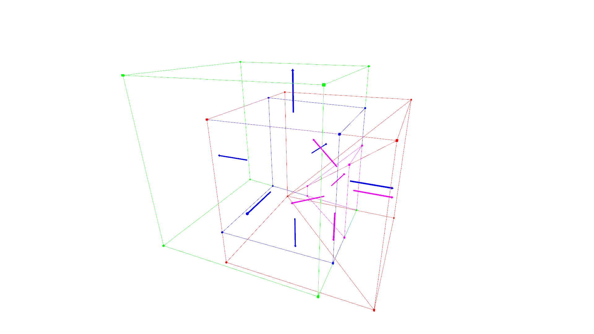

Renderer Examples
=================

Creating Geometries
-------------------

    >>> a = Point(1,2,1)
    >>> c = Point(-1,-1,1)
    >>> d = Point(1,-1,1)
    >>> e = Point(1,1,-1)
    >>> h = Point(1,-1,-1)
    >>> 
    >>> s = Segment(a,c)
    >>> 
    >>> cpg = ConvexPolygon((a,d,h,e))
    >>> 
    >>> cph = Parallelepiped(Point(-1.5,-1.5,-1.5),Vector(2,0,0),Vector(0,2,0),Vector(0,0,2))

Getting a Renderer with matplotlib backend
------------------

    >>> r = Renderer(backend='matplotlib')

Adding Geometries
-----------------

    >>> r.add((a,'r',10),normal_length=0)
    >>> r.add((d,'r',10),normal_length=0)
    >>> r.add((s,'g',3),normal_length=0)
    >>> r.add((cpg,'b',2),normal_length=0)
    >>> r.add((cph,'y',1),normal_length=1)

Displaying Geometries
---------------------

    >>> r.show()

.. image:: _static/p1.png

Getting a Renderer with open3d backend
------------------

    >>> r_o3d = Renderer(backend="open3d")

Adding Geometries
-----------------

    >>> r_o3d.add((cph0, (1, 0, 0), 0.02),normal_length = 0)
    >>> r_o3d.add((cph1, (1, 0, 0), 0.02),normal_length = 0)
    >>> r_o3d.add((cph2, (0, 1, 0), 0.02),normal_length = 0)
    >>> r_o3d.add((cph3, (0, 0, 1), 0.02),normal_length = 0.5)
    >>> r_o3d.add((cph4, (1, 0, 1), 0.02),normal_length = 0.5)

Displaying Geometries
---------------------

    >>> r_o3d.show()

