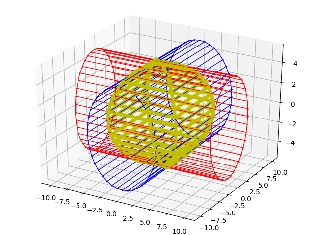
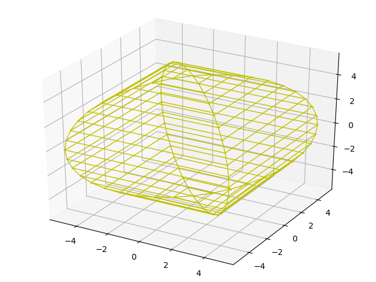

First Example
=============

Steinmetz solid
---------------
This part shows how to use Geometry3D to calculate the volumn and area of a Steinmetz solid.  
Simply run the code below after installation::

    >>> from Geometry3D import *
    >>> import copy
    >>> radius=5
    >>> s1 = Cylinder(Point(-2 * radius,0,0),radius,4*radius * x_unit_vector(),n=40)
    >>> s2 = Cylinder(Point(0,-2 * radius,0),radius,4*radius * y_unit_vector(),n=40)
    >>> s3 = intersection(s1,s2)
    >>> r = Renderer()
    >>> r.add((s1,'r',1))
    >>> r.add((s2,'b',1))
    >>> r.add((s3,'y',5))
    >>> r.show()
    >>> 
    >>> r2 = Renderer()
    >>> r2.add((s3,'y',1))
    >>> r2.show()
    >>> import math
    >>> v_real = 16 / 3 * math.pow(radius,3)
    >>> a_real = 16 * math.pow(radius,2)
    >>> print('Ground truth volume of the Steinmetz solid is:{}, Calculated value is {}'.format(v_real,s3.volume()))
    Ground truth volume of the Steinmetz solid is:666.6666666666666, Calculated value is 662.5627801983807
    >>> print('Ground truth surface area of the Steinmetz solid is:{}, Calculated value is {}'.format(a_real,s3.area()))
    Ground truth surface area of the Steinmetz solid is:400.0, Calculated value is 398.76693349325194

